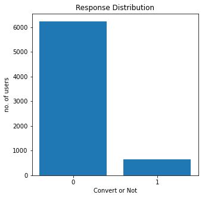

# NIDA - BADS7105

## Homework 08 – Campaign Response Model
---
การจัดทำแคมเปญทางการตลาดในทางปฎิบัติ จะไม่สามารถนำส่งให้กับลูกค้าทุกรายได้ ด้วยข้อจำกัดทางงบประมาณ และโอกาสที่จะได้รับการตอบรับมีน้อย ในลูกค้าบางกลุ่มอาจมีความไม่พอใจจากความรำคาญในสิ่งที่ไม่สนใจ 

ในอุดมคติทางการตลาด ถ้าแคมเปญตรงกับควาสนใจของลูกค้าเป้าหมาย จะช่วยกระตุ้นให้เกิดการตัดสินต่อการซื้อที่มากขึ้น

โดยใช้แนวทางการวิเคราะห์ข้อมูลประวัติการซื้อหรือการใช้บริการมาพัฒนาตัวแบบพยากรณ์ (predicition model) การตอบสนองต่อแคมเปญ (campaign response) ที่ช่วยเพิ่มโอกาสที่จะได้รับการตอบรับดีมากขึ้น

### Features for Prediction

ข้อมูลประวัติการซื้อเบื้องต้น

Feature | อธิบาย
-|-
Custom id | รหัสประจำตัวลูกค้า
Transaction date | วันที่ทำธรุกรรม/ซื้อ 
Transaction amount | จำนวนเงินที่ทำธุรกรรม/ซื้อ

และการตอบรับแคมเปญจนถึงเมื่อวานหรือที่ผ่านมาล่าสุด
Feature | อธิบาย
-|-
Custom id | รหัสประจำตัวลูกค้า
Response | การตอบรับแคมเปญล่าสุด

จากข้อมูลประวัติและการตอบรับข้างต้น ต้องนำคำนวณหาค่า

### Imbalance Data

ปัญหาของจำนวนข้อมูลระหว่างลูกค้าที่ตอบสนองกับแคมเปญ และไม่ตอบสนอง ในบางกรณีมีอัตราส่วนที่มากกว่า 10 เท่า จะส่งผลกระทบต่อการสร้างตัวแบบการเรียนรู้ด้วยเครื่องจักร (machine learning model) ให้การนำไปประยุกต์ใช้งานจริง จะมีความแม่ยำในอัตราที่ต่ำ จึงต้องมีการจัดการอัตราส่วนทั้งสองกรณีมีจำนวนใกล้เคียงกัน ก่อนนำสอนในการสร้างตัวแบบ

ในการจัดเตรียมข้อมูลให้มีจำนวนในอัตราส่วนใกล้เคียงกัน สามารถทำได้ 3 วิธี ได้แก่
1. Under-sampling
2. Over-sampling
3. SMOTE (Synthetic Minority Over-sampling Technique)